# Distributed Task Queue

A production-grade, distributed task queue built in TypeScript with Redis as the sole backend. Comparable to BullMQ in capability but built from scratch with zero third-party queue libraries.

## Architecture

```mermaid
graph TB
    subgraph Producers
        API[Fastify API]
    end

    subgraph Redis
        WH[queue:*:waiting:high]
        WN[queue:*:waiting:normal]
        WL[queue:*:waiting:low]
        D[queue:*:delayed — ZSET]
        DLQ[queue:*:dead — LIST]
        JH[job:id — HASH]
        HB[heartbeat:id — STRING + TTL]
        AJ[active_jobs:* — HASH]
        M1[jobs_processed_total]
        M2[jobs_failed_total]
        M3[processing_time_sum_ms]
    end

    subgraph Consumers
        WP[WorkerPool — N×BRPOP]
        SCH[Scheduler — 500ms poll]
        WD[Watchdog — 10s poll]
    end

    API -->|LPUSH| WH & WN & WL
    API -->|HMSET| JH

    WP -->|BRPOP high,normal,low| WH & WN & WL
    WP -->|HGETALL / HSET| JH
    WP -->|SET + EX| HB
    WP -->|HSET| AJ
    WP -->|ZADD| D
    WP -->|LPUSH| DLQ
    WP -->|INCR| M1 & M2 & M3

    SCH -->|ZRANGEBYSCORE| D
    SCH -->|LPUSH| WH & WN & WL

    WD -->|HGETALL| AJ
    WD -->|MGET| HB
    WD -->|LPUSH| WH & WN & WL
```



## Features

| Feature | Implementation |
|---------|---------------|
| **Priority Queuing** | Three Redis lists (`high`, `normal`, `low`). `BRPOP` with keys in order guarantees strict priority. |
| **Concurrent Workers** | N dedicated Redis connections, one per worker. Each runs its own blocking `BRPOP` loop. |
| **Exponential Backoff** | `min(30s, 1s × 2^attempt) + jitter`. Failed jobs go to a `ZSET` scored by due-timestamp. |
| **Dead-Letter Queue** | Jobs exceeding `maxAttempts` are moved to a dead list for manual inspection / retry. |
| **Heartbeat Watchdog** | Workers `SET heartbeat:<id> EX 15` every 5s. Watchdog detects expired heartbeats and requeues. |
| **Metrics** | `INCR`-based counters for processed, failed, and cumulative processing time. |
| **Structured Logging** | JSON lines (`{ ts, level, component, msg, ...ctx }`) — ready for ELK / Loki / Datadog. |
| **Graceful Shutdown** | `SIGINT`/`SIGTERM` → stop loops → drain in-flight jobs → disconnect Redis. |

## Redis Data Model

| Key Pattern | Type | Purpose |
|-------------|------|---------|
| `job:<uuid>` | Hash | Full job metadata (type, data, status, attempts, priority, timestamps) |
| `queue:<name>:waiting:<priority>` | List | Waiting job IDs per priority level |
| `queue:<name>:delayed` | Sorted Set | Delayed jobs, scored by due-timestamp (ms) |
| `queue:<name>:dead` | List | Dead-letter job IDs |
| `active_jobs:<name>` | Hash | Currently processing jobs: `jobId → { workerId, startedAt }` |
| `heartbeat:<uuid>` | String | `"1"` with TTL; renewed every 5s by the processing worker |
| `jobs_processed_total` | String (int) | Counter — total successfully processed |
| `jobs_failed_total` | String (int) | Counter — total failures |
| `processing_time_sum_ms` | String (int) | Cumulative processing time for avg calculation |

## Project Structure

```
src/
├── config/index.ts         # Centralized typed config (env vars)
├── errors/index.ts         # Custom error classes
├── lib/
│   ├── logger.ts           # Structured JSON logger
│   └── redis/
│       ├── client.ts       # Redis singleton + blocking client factory
│       ├── keys.ts         # All Redis key builders
│       └── job-store.ts    # Job serialize / deserialize / CRUD
├── queue/Queue.ts          # Producer — enqueue + queue depths
├── worker/
│   ├── WorkerPool.ts       # N-worker consumer with heartbeats
│   └── Watchdog.ts         # Stalled job detector
├── scheduler/Scheduler.ts  # Delayed → waiting mover
├── api/routes.ts           # REST API (stats, jobs, retry)
├── types/index.ts          # All TypeScript interfaces & types
└── index.ts                # Application entry point
```

## Quick Start

### With Docker Compose (recommended)

```bash
# Start Redis + RedisInsight
docker-compose up -d

# Install dependencies
npm install

# Run the application
npx tsx src/index.ts
```

RedisInsight UI is available at **http://localhost:5540**.

### Local Redis

```bash
# Ensure Redis is running on 127.0.0.1:6379
npm install
npx tsx src/index.ts
```

## API Endpoints

| Method | Path | Description |
|--------|------|-------------|
| `GET`  | `/stats` | Queue depths + processing metrics |
| `GET`  | `/jobs/:id` | Single job details |
| `GET`  | `/jobs?status=dead&limit=20&offset=0` | Paginated job list by status |
| `POST` | `/jobs/:id/retry` | Move dead/failed job back to waiting |
| `POST` | `/jobs/test` | Enqueue a demo job (for testing) |

## Configuration

All tunables are overridable via environment variables:

| Variable | Default | Description |
|----------|---------|-------------|
| `REDIS_HOST` | `127.0.0.1` | Redis server host |
| `REDIS_PORT` | `6379` | Redis server port |
| `QUEUE_NAME` | `main_queue` | Default queue name |
| `WORKER_CONCURRENCY` | `5` | Number of concurrent workers |
| `HEARTBEAT_INTERVAL_MS` | `5000` | Heartbeat renewal interval |
| `HEARTBEAT_TTL_SEC` | `15` | Heartbeat key TTL in Redis |
| `WATCHDOG_INTERVAL_MS` | `10000` | Watchdog stall-check interval |
| `SCHEDULER_INTERVAL_MS` | `500` | Scheduler delayed-job poll interval |
| `BACKOFF_MAX_DELAY_MS` | `30000` | Maximum retry backoff delay |
| `BACKOFF_JITTER_MS` | `200` | Random jitter added to backoff |
| `API_PORT` | `3000` | Fastify HTTP port |
| `API_HOST` | `0.0.0.0` | Fastify bind address |

## Design Decisions

### Why N BRPOP connections instead of 1?

`BRPOP` blocks the entire TCP socket. If all workers shared one connection, only the first worker's `BRPOP` would execute — the rest would queue behind it in `ioredis`'s command buffer, reducing the pool to a single sequential worker. Each worker therefore gets a dedicated connection created via `redis.duplicate()`.

### Why heartbeats instead of TTLs on job keys?

A TTL on the job hash itself is dangerous: if a legitimate job takes 31 seconds but the TTL is 30, Redis expires the key and the system treats a healthy worker as dead, causing duplicate execution. A separate `heartbeat:<id>` key with periodic renewal cleanly distinguishes "worker crashed" from "task is slow".

### Why BRPOP key ordering for priority?

Redis's `BRPOP key1 key2 key3 timeout` checks keys left-to-right and pops from the first non-empty list. By passing `[high, normal, low]`, Redis guarantees strict priority ordering at the C level with zero application-side overhead.

## Testing

```bash
# Run all integration tests (requires Redis or Docker)
npm test
```

Tests use `testcontainers` to spin up an ephemeral Redis container. If Docker is unavailable, they fall back to a local Redis instance.

## Performance

Benchmarks run on local hardware against a single Redis instance (`localhost:6379`) using 100-job batches. All jobs use an immediate-resolve handler to measure pure queue overhead.

> Run: `npx tsx scripts/benchmark.ts`

### Concurrency Scaling

| Concurrency | Throughput (jobs/sec) |
|:-----------:|:---------------------:|
| 1           | ~251                  |
| 5           | ~741                  |
| 10          | ~1,149                |

Throughput scales linearly with concurrency, limited by the number of Redis round-trips per job (~5 commands: `BRPOP`, `HGETALL`, `HSET`, `SET heartbeat`, `MULTI/EXEC`).

### Summary

```
═══════════════════════════════════════
         === BENCHMARK RESULTS ===
═══════════════════════════════════════
  Peak Throughput:       1,149 jobs/sec (concurrency=10)
  p50 Dispatch Latency:  3ms
  p95 Dispatch Latency:  8ms
  p99 Dispatch Latency:  9ms
═══════════════════════════════════════
```

## License

MIT
