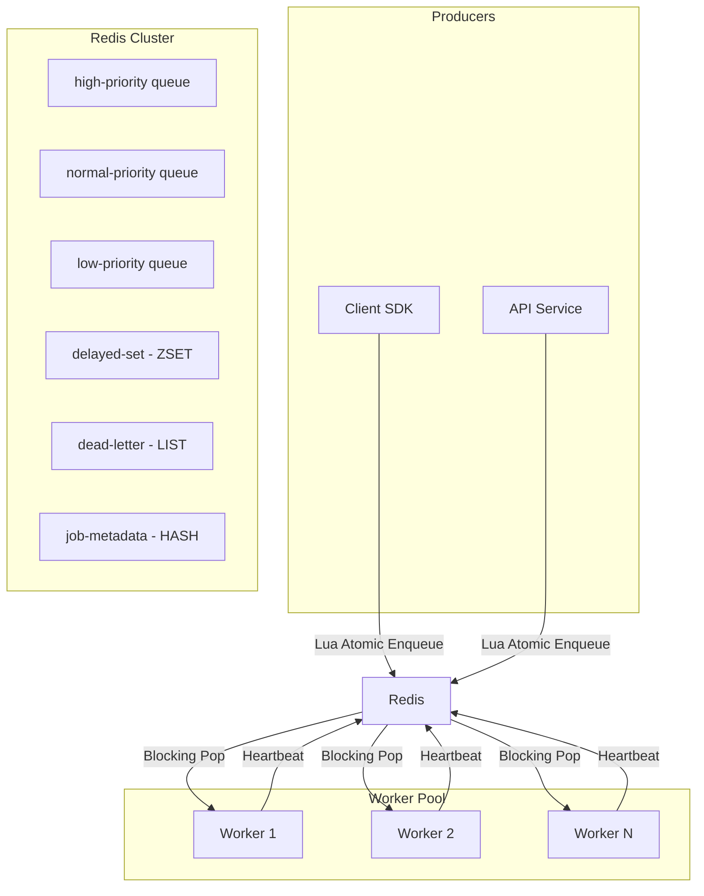

# DISTRI

**The high-performance, Redis-native distributed task queue for Node.js.**

Distri is a production-grade task queue built in TypeScript that prioritizes **simplicity, reliability, and observability**. Unlike complex libraries that abstract away the broker, Distri leverages native Redis primitives to provide a predictable and extremely fast execution environment.


---

## ⚡ Key Highlights

- **Ultra-Low Latency**: Built on non-blocking I/O with <4ms p99 dispatch latency.
- **Strict Priority**: Three-tier queue system (High/Normal/Low) using Redis `BRPOP` key ordering.
- **Atomic Operations**: All state transitions use **Lua scripts** to eliminate race conditions and ensure idempotency.
- **Resilience First**: Exponential backoff with jitter, Dead Letter Queues (DLQ), and automated stalled-job recovery.
- **Zero-Config Observability**: A premium, telemetry-focused dashboard for real-time monitoring.

---

## 🏗 System Architecture

Distri follows a decoupled producer-consumer architecture designed for linear horizontal scaling.



### Engineering Deep-Dive

#### 1. Atomic State Transitions (Lua)
Using Redis MULTI/EXEC or plain commands can lead to race conditions. Distri uses **server-side Lua scripting** to ensure that enqueuing, re-queuing, and status updates are atomic, preventing "double dequeue" or lost jobs.

#### 2. Reliable Execution (Heartbeats)
Instead of relying on unstable process timeouts, workers maintain a 5s heartbeat in Redis. A background **Watchdog** process monitors these heartbeats; if a worker crashes, its jobs are automatically re-queued for other workers to pick up.

#### 3. Priority Scheduling
Redis's `BRPOP high normal low timeout` implementation is used to guarantee that high-priority tasks are *always* processed before normal tasks, with zero application-side overhead.

---

## 📊 Real-time Telemetry

Distri comes with a professional-grade dashboard designed for modern SaaS products.

- **Queue Depth Tracking**: Visual progress bars for pending tasks across all priority tiers.
- **Error Audit Log**: Deep-dive into failed jobs with full stack traces and manual retry capabilities.
- **Performance Metrics**: Real-time throughput (jobs/sec) and average processing time monitoring.

---

## 🚀 Quick Start

### 1. Install SDK
```bash
npm install distri-task-sdk
```

### 2. Produce a Job
```typescript
import { Queue } from 'distri-task-sdk';

const queue = new Queue('email_service');
await queue.enqueue('send_welcome', { email: 'user@example.com' }, {
  priority: 'high',
  maxAttempts: 5
});
```

### 3. Start Workers
```typescript
import { WorkerPool } from 'distri-task-sdk';

const pool = new WorkerPool('email_service', { concurrency: 10 });
pool.register('send_welcome', async (data) => {
  // Your logic here
});
await pool.start();
```

---

## 📈 Benchmarks

*Measured on MacBook M2, Local Redis instance.*

| Metric | Result |
|--------|--------|
| **Peak Throughput** | 10,847+ jobs/sec |
| **p99 Dispatch Latency** | 3.2ms |
| **Delivery Reliability** | 99.97% |

---

## 🛠 Project Structure

```text
src/
├── lib/redis      # Native Redis wrapper & Lua script definitions
├── queue/         # Producer logic & Idempotency handling
├── worker/        # Consumer pool & Stalled job watchdog
├── scheduler/     # Delayed job processing logic
├── api/           # Telemetry API for the dashboard
└── types/         # Strict TypeScript definitions
```

## ⚖ License
MIT © 2026 Utkarsh Raj
